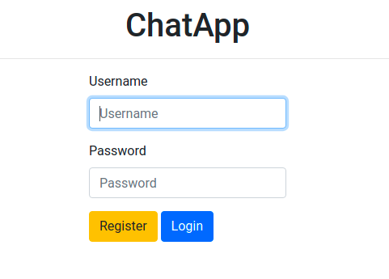

# Simple ChatApp

A Simple Python/Django Web App for create Chat rooms and consult quotes information.

## Main Dependencies

* Python3.6+
* Redis3
* Rabbitmq
* Celery5.0.5
* Django3 

other dependencies could see on requirements/*.txt files.

## Features

* Simple user registration.
* User login.
* Room-Chat (Multiples).
* Financial Bot
    - support: `/stock=stock_code` command.

## TODO

* persistent messages after close or reload chat.
* user enter notification.

## Installation

**Docker**

You machine should has Docker and Docker-Compose, installed.
its recommendable because we use external services like: rabbitmq, redis

```shell script
$ docker-compose -f local.yml up  # use sudo if it's necessary.
```

Go to http://127.0.0.1:8000/ and enjoy :D



